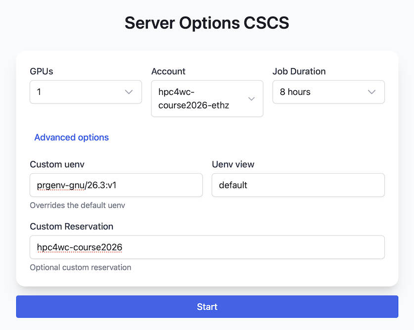

# Getting Started

These instructions set up the Python environment used by the HPC4WC course on CSCS Santis.

## Launch JupyterHub

1. Open <https://jupyter-santis.cscs.ch>.
2. Sign in with your CSCS account (course_XXXXX).
3. Click on "Start My Server"
4. Enter the details according to the image below.
5. Start the server and wait until JupyterLab opens.



| Setting | Value |
|---|---|
| GPUs | `1` |
| Account | `hpc4wc-course2026-ethz` |
| Job Duration | `8 hours` |
| Custom uenv | `prgenv-gnu/26.3:v1` |
| Uenv view | `default` |
| Custom Reservation | `hpc4wc-course2026` |

JupyterHub sessions run inside a Slurm job on Santis compute nodes. This is different from `ssh santis`, which logs in to a login node. The login node is useful for repository work and Slurm submission, but GPU, CUDA, and `srun` behavior must be checked on compute nodes.

## Clone the Course Repository

Open a JupyterLab terminal and run:

```bash
cd "$HOME"
git clone https://github.com/ofuhrer/HPC4WC.git
```

## Install the Course Environment

Run the setup script from the JupyterLab terminal:

```bash
cd "$HOME/HPC4WC"
./setup/HPC4WC_setup.sh
```

The script creates a Python virtual environment under `$SCRATCH`, symlinks it as `$HOME/HPC4WC_venv`, registers the `HPC4WC_kernel` Jupyter kernel, and validates the CPU-side Python stack.

Note: If you need to access the environment from a terminal, activate the environment with:

```bash
source "$HOME/activate_hpc4wc.sh"
```

## Restart JupyterHub

After the setup finishes, select File -> Hub Control Panel.
Stop the JupyterHub server. Then restart your JupyterHub server using the settings in the image above.

## Test the Setup

In the sidebar on the left, open the `HPC4WC` folder and inside it the `setup` folder. Run the notebook `02-test-setup.ipynb`.

It checks the basic functionalities required for the course, namely NumPy, Matplotlib, MPI, CuPy, GT4Py, and the package versions expected for the course. The GT4Py tests will issue some warnings which you can ignore.

You are all set and ready to go!
